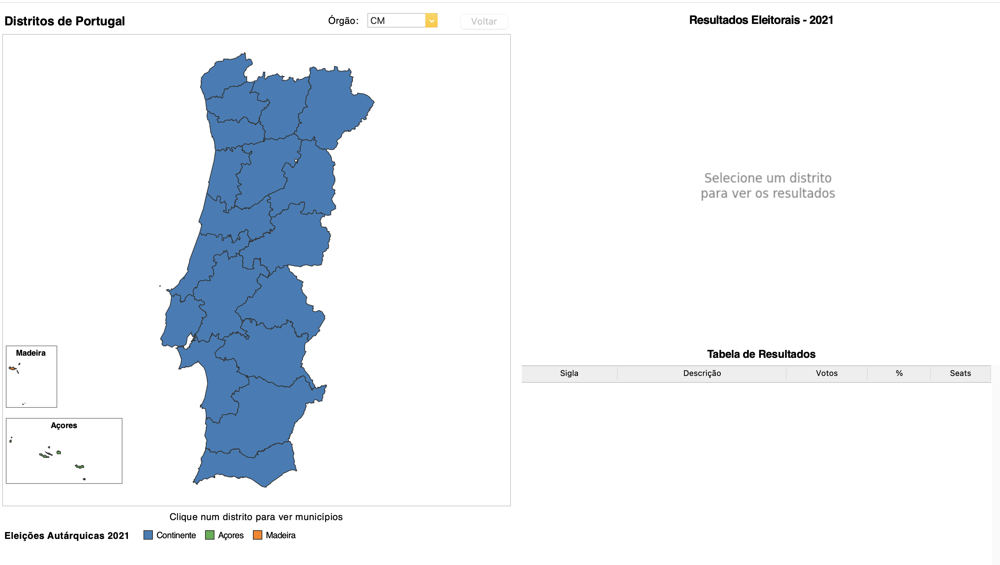
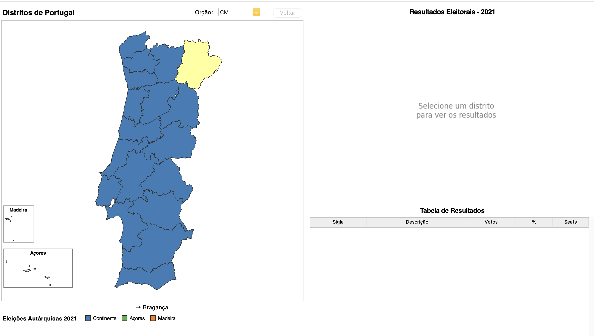
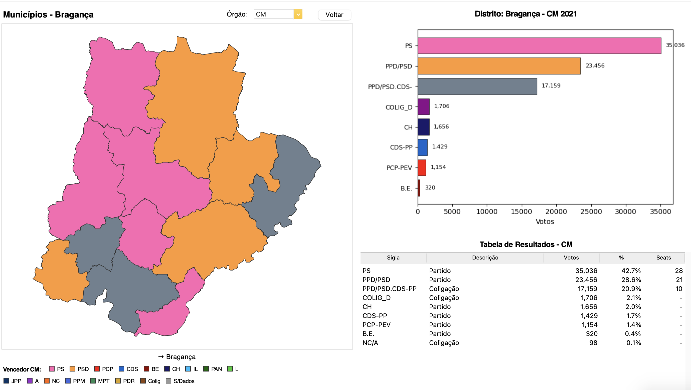
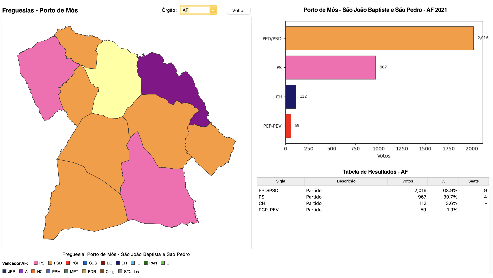

# Eleições Autárquicas 2021 — Visualizador Interativo

Sistema de visualização dos resultados das Eleições Autárquicas Portuguesas de
2021, com mapa interativo e análise de dados (Python + SQLite + Tkinter).

## Grupo

- José Alves
- Mariana Gomes

## Capturas de ecrã

| | |
|---|---|
|  |  |
|  |  |

## Requisitos

- Python 3.8+
- Bibliotecas: `pandas`, `openpyxl`, `matplotlib` (e `tkinter`, incluído na maioria das instalações Python)

```bash
pip install -r requirements.txt
```

## Estrutura do Projeto

```
projeto/
├── README.md
├── LICENSE
├── requirements.txt
├── db/
│   ├── elections.db            # Base de dados SQLite (já gerada)
│   └── create_tables.sql       # DDL — schema da BD
├── etl/
│   ├── etl_eleicoes.py         # Script ETL principal
│   └── portugal_geoms_dump.sql # Geometrias WKT de Portugal
├── app/
│   └── gui.py                  # Aplicação GUI principal
└── docs/
    ├── ER_diagram.svg          # Diagrama Entidade-Relação
    ├── er_diagram.drawio.png   # Diagrama ER (imagem)
    └── screenshot_1..4.png     # Capturas de ecrã
```

## Como Executar

A base de dados (`db/elections.db`) já vem gerada, por isso podes correr a
aplicação diretamente (Passo 3). Os Passos 1 e 2 só são necessários para
reconstruir a BD de raiz a partir dos dados oficiais.

### Passo 3 (rápido): Executar a aplicação

```bash
cd app/
python gui.py
```

### Passo 1: Preparar os dados (opcional — reconstruir a BD)

Descarregar os dados oficiais da CNE e colocá-los em `etl/2021al_mapa_oficial/`:

```bash
wget https://www.cne.pt/sites/default/files/dl/2021al_mapa_oficial.zip
unzip 2021al_mapa_oficial.zip -d etl/2021al_mapa_oficial/
```

A pasta deve conter:
```
etl/2021al_mapa_oficial/
├── mapa_1_resultados.xlsx
├── mapa_2_perc_mandatos.xlsx
├── mapa_3_eleitos.xlsx
└── mapa_anexo.xlsx
```

### Passo 2: Executar o ETL (opcional)

```bash
cd etl/
python etl_eleicoes.py
```

O script irá:
- Criar a base de dados SQLite em `db/elections.db`
- Carregar as geometrias de Portugal
- Processar os dados eleitorais do Excel
- Popular todas as tabelas

**Output esperado:**
```
============================================================
ETL - Eleições Autárquicas 2021
============================================================
✓ 308 municípios
✓ 3087 freguesias
✓ 10730 votos
============================================================
ETL concluído!
============================================================
```

## Funcionalidades

### Mapa Interativo
- **Nível 1**: Distritos de Portugal (+ caixas Açores e Madeira)
- **Nível 2**: Municípios do distrito selecionado
- **Nível 3**: Freguesias do município selecionado

### Visualização de Resultados
- Gráfico de barras com Top 10 partidos/coligações
- Tabela detalhada com votos e percentagens
- Estatísticas de participação (inscritos, votantes, abstenção)

### Cores por Partido
- PS (rosa), PSD (laranja), PCP-PEV (vermelho), CDS-PP (azul)
- BE (roxo), CH (azul escuro), IL (ciano), PAN (verde azulado)
- E mais 13 partidos com cores distintas
- Coligações com cores únicas baseadas em hash

## Schema da Base de Dados

```
districts          - 29 distritos/ilhas com geometrias
municipalities     - 308 municípios com geometrias
parishes           - freguesias com geometrias
partidos           - 21 partidos políticos
orgaos             - 3 órgãos (CM, AM, AF)
coligacoes         - coligações únicas
resultados         - resultados agregados por autarquia
votos              - votos por partido/coligação
```

Ver o diagrama Entidade-Relação em [`docs/ER_diagram.svg`](docs/ER_diagram.svg).

## Âmbito dos Dados

- **Órgãos**: Câmara Municipal (CM) e Assembleia de Freguesia (AF)
- **Geografia**: Portugal completo (continente + ilhas)
- **Fonte**: CNE — Comissão Nacional de Eleições

## Limitações Conhecidas

1. Assembleia Municipal (AM) não incluída na visualização
2. Algumas freguesias com dados pendentes na fonte original
3. Geometrias simplificadas (apenas anel exterior)

## Referências

- [CNE — Resultados Oficiais](https://www.cne.pt)
- [MAI — Portal Eleitoral](https://www.eleicoes.mai.gov.pt/autarquicas2021/)
- [DGT — CAOP](https://www.dgterritorio.gov.pt/cartografia/cartografia-tematica/caop)

## Licença

Distribuído sob a licença MIT. Ver [`LICENSE`](LICENSE) para detalhes.
